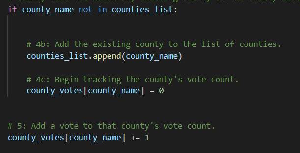

# Election_Analysis

## Project Overview
A Colorado Board of Elections employee has contracted me to perform an analysis of the recent election results. Some of the following statistics were considered in scope for the investigation and analysis:

1. Total number of votes cast.
2. Complete candidate list of those who received votes.
3. Total number of votes each candidate received.
4. Percentage of votes for each candidate won.
5. Winner of the election based on popular vote.
6. Number of votes per county.
7. County with the largest number of votes.

## Resources
- Data Source: election_results.csv
- Software: Python 3.10.1

## Results
The analysis of the election show that:
- There were 369,711 votes cast.

### County Results:
- The counties were:
  - Jefferson
  - Denver
  - Arapahoe
 - The county results were:
   - Jefferson county casted 10.5% of the votes and 38,855 total votes.
   - Denver casted 82.8% of the votes and 306,055 total votes.
   - Arapahoe received 6.7% of the votes and 24,801 total votes.
 - The largest number of votes casted was in Denver
 - The photo below explains how the counties were aggregated into a single list.
 

### Candidate Results:
- The candidates were:
  - Charles Casper Stockham
  - Diana DeGette
  - Raymon Anthony Doane
 - The candidate results were:
   - Charles Casper Stockham received 23.0% of the vote and 85,213 number of votes.
   - Diana DeGette received 73.8% of the vote and 272,892 number of votes.
   - Raymon Anthony Doane received 3.1% of the vote and 11,606 number of votes.
 - The winner of the election was:
  - Diana DeGette who received 73.8% of the vote and 272,892 number of votes.

## Election Audit Summary
- This code can be reused for further election analyses by uploading a new election results csv to the github resources repo. The code is written to be dynamic and will change as needed based on the data input.
- Further, the code can be altered to output different types of data. A date of vote could be added to the data set and leveraged to determine momentum in voting. Another change could be to automatically pull the data from a registry so a live vote could be tallied and analyzed.
